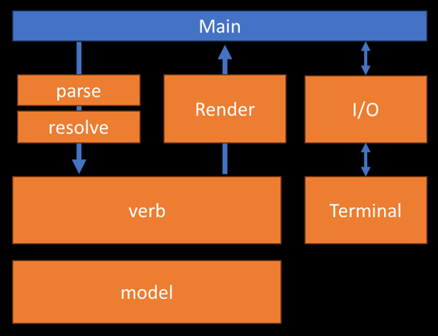

# Kingdom Engine Architecture: Layer Responsibilities and Data Flow

This document describes the conceptual layers of the Kingdom text-adventure engine and the responsibilities of each layer. The goal is to maintain a clear separation of concerns, reduce architectural leaks, and support incremental evolution — including dual classic TRS-80 and modern (LLM-enhanced) output modes.

The engine is organized into eight cooperating layers:

1. Terminal Layer (Device / Presentation)
2. Input Layer (UI / Interaction)
3. Renderer Layer (Formatting & Natural Language Generation)
4. Main Loop (Orchestrator)
5. Parser Layer (Syntax)
6. Resolution Layer (Semantics)
7. Verb Layer (Action Execution)
8. Game model Layer (World State)

Each layer has a single, well-defined responsibility and communicates with adjacent layers through structured data rather than raw text.

---

## Import Dependency Diagram

---

## Import Dependency Diagram 
```
Main
├── UI
│   └── Terminal
├── Renderer
├── Parser
│   └── Resolver
│       └── Verbs
│           └── model
```


### Process flow

Input path
```
UI → Main → Parser → Resolver → Verbs → model
```
Ouput path
```
model → Verbs → Renderer → Main → UI → Terminal
```




---

## 1. Terminal Layer (Device / Presentation)

Low-level abstraction over the output/input device. Provides TRS-80 emulation and modern terminal capabilities.

**Responsibilities**  
- Clear the screen  
- Print text with device-specific styles (TRS-80 uppercase/green-on-black, modern ANSI/rich)  
- Handle cursor positioning, semigraphics (if needed), and terminal quirks  
- Provide minimal blocking input (`get_input(prompt)`)  

**Non-Responsibilities**  
- No game knowledge  
- No prompts, questions, or confirmation dialogs  
- No formatting or sentence construction  
- No save/load logic  

---

## 2. Input Layer (UI / Interaction)

Game-aware player interaction layer between Terminal and engine core.

**Responsibilities**  
- Collect raw player input  
- Display renderer-produced lines via Terminal  
- Handle confirmation questions (y/n)  
- Manage save/load file paths and basic dialogs  
- Provide consistent interaction idioms ("What now?", status line, etc.)  

**Non-Responsibilities**  
- No command parsing or resolution  
- No world mutation  
- No sentence formatting or styling  

---

## 3. Renderer Layer (Formatting & Natural Language Generation)

The only layer responsible for turning structured game facts into human-readable, styled text. Mediates between raw results and presentation.

**Responsibilities**  
- Convert `ActionResult` (facts, events, failure codes) into natural-language sentences  
- Format room descriptions, inventory lists, error messages, verb outcomes  
- Apply mode-specific styling (TRS-80: uppercase, 64-col limit; modern: natural prose, potential LLM creative rephrasing)  
- Return presentation-ready lines (list[str]) to caller  
- Centralize game voice, tense, and phrasing consistency  

**Non-Responsibilities**  
- No world mutation  
- No parsing, resolution, or verb execution  
- No direct input handling  

## 4. Main (Entry Point & Orchestrator)

The "Main" component handles both initial game startup and the per-turn orchestration loop. For clarity, it is conceptually split into two cooperating parts:

### 4a. Main Entry Point

Responsible for one-time game initialization and player greeting.

**Responsibilities**  
- Greet the player (welcome message, hero name prompt)  
- Build/load the initial world state (rooms, items, player)  
- Set up core components (Parser, Resolver, Verb registry, Renderer, UI/Terminal)  
- Create initial `Game`, `Player`, `GameActionState`, `DispatchContext`  
- Handle command-line args (e.g., mode: trs80/modern)  
- Start logging/session if needed  

**Non-Responsibilities**  
- No per-turn command processing  
- No repeated input/output loop  
- No direct parsing, resolution, verb execution, or rendering  

### 4b. Main Loop (Orchestrator)

Thin coordinator of a single turn. Delegates work and threads data between layers.

**Responsibilities**  
- Receive raw input from UI  
- Pass input to Parser → Resolver → Verb system  
- Receive `ActionResult` from Verb  
- Pass `ActionResult` + context to Renderer  
- Forward rendered lines to UI for display  
- Manage lifecycle (quit, load, save, logging, top-level exceptions, recovery modes)  

**Non-Responsibilities**  
- No noun resolution  
- No sentence construction or formatting  
- No direct world mutation beyond lifecycle transitions  

(Note: In practice, the Entry Point may call into the Loop after setup, or the Loop may be a method on a thin `GameEngine` class owned by the Entry Point.)

---

## 5. Parser Layer (Syntax)

Converts raw player text into a syntactic structure. Understands basic game grammar but has no deep world-model knowledge.

**Responsibilities**  
- Tokenize the input string  
- Identify the primary verb word  
- Extract noun phrases, prepositions, adverbs, and leftover words  
- Recognize known game verbs and basic noun references/synonyms  
- Produce a `ParsedCommand` object containing only syntactic information  

**Non-Responsibilities**  
- No object lookup, disambiguation, or direction resolution  
- No semantic validation or error messaging beyond syntax issues  
- No knowledge of object locations, states, or game rules  

---

## 6. Resolution Layer (Semantics)

Bridges syntax to world state; produces executable intent.

**Responsibilities**  
- Resolve noun phrases to real objects  
- Resolve directions, abstract nouns, indirect objects  
- Handle disambiguation  
- Extract action-modifying keywords  
- Produce `ResolvedAction` (verb + resolved targets + metadata)  

**Non-Responsibilities**  
- No world mutation  
- No verb execution  
- No formatting  

---

## 7. Verb Layer (Action Execution)

Behavioral core — executes resolved actions and mutates model.

**Responsibilities**  
- Implement verb-specific logic  
- Mutate game state (move, open, take, etc.)  
- Enforce rules/constraints  
- Return structured `ActionResult` (success/failure + facts/events/failure codes + effect metadata)  
- Remain modular (per-verb classes + special-handler registry)  

**Non-Responsibilities**  
- No parsing or resolution  
- No sentence construction or formatting  
- No raw input/output  

---

## 8. Game model Layer (World State)

Persistent, queryable truth of the game world.

**Responsibilities**  
- Represent rooms, items, containers, actors  
- Maintain player/inventory state  
- Provide queries (exits, contents, visibility)  
- Support save/load  
- Enforce structural invariants  

**Non-Responsibilities**  
- No parsing, resolution, verb logic  
- No rendering, UI, or terminal interaction  

---

## Data Flow Between Layers

Unidirectional with clear contracts: